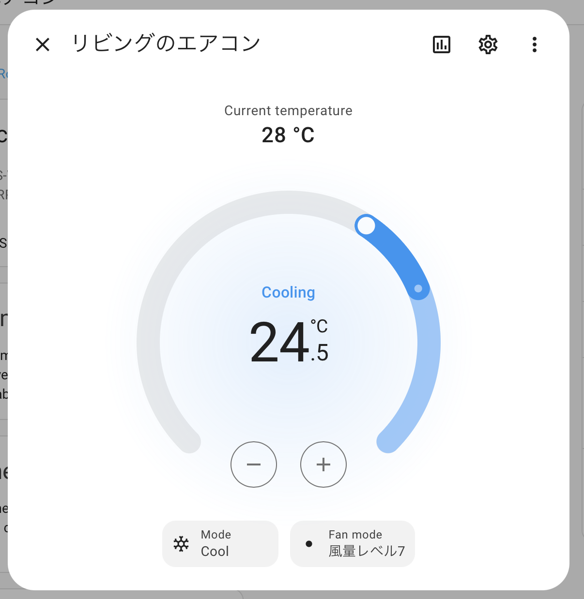

# ha-sharp-cocoro

Homeassistant integration for Sharp Cocoro Air (Sharp Aircon)

Super WIP

## What's working

Will try to load supported devices from Sharp Cocoro Air API and configure them

Currently supported device types:

- Aircon 

## Installation

You can also install manually by copying the `custom_components` from this repository into your Home Assistant installation.

## Authentication

Check README of https://github.com/dvcrn/sharp-cocoro

Sharp appliances sold in **Egypt (El Araby)** are on a different service:
`serviceName` is `sharp-egy`, and the account login is El Araby's own Azure AD
B2C tenant rather than Sharp's. See
**[docs/egypt-el-araby.md](./docs/egypt-el-araby.md)**.

Worth knowing even if you are not in Egypt: `app_key` is a `terminalAppId` that
is **minted per installation** rather than being a fixed secret, and binding a
freshly minted one does not necessarily pair it to every appliance on the
account. A key can therefore authenticate correctly and still make
`query_devices()` raise on a box it was never paired to.