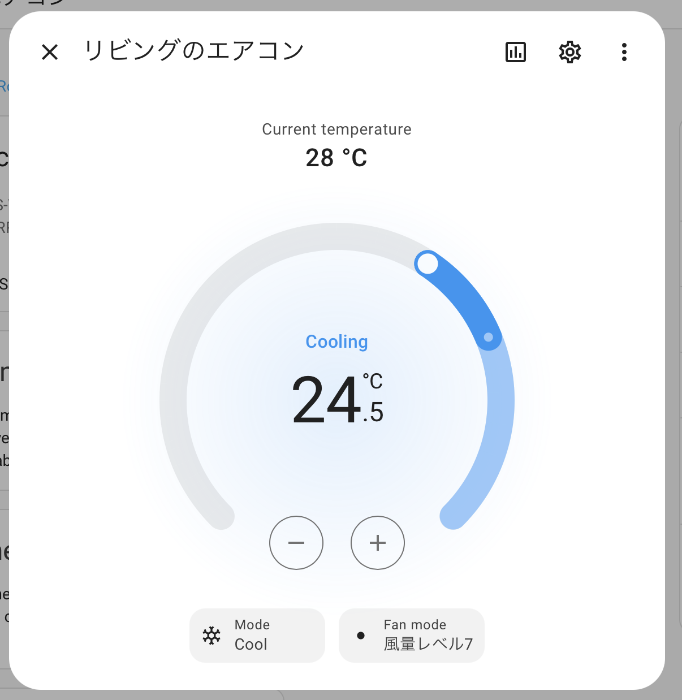

# ha-sharp-cocoro

Homeassistant integration for Sharp Cocoro Air (Sharp Aircon)

Super WIP

## What's working

Will try to load supported devices from Sharp Cocoro Air API and configure them

Currently supported device types:

- Aircon 

## Installation

You can also install manually by copying the `custom_components` from this repository into your Home Assistant installation.

## Authentication

Check README of https://github.com/dvcrn/sharp-cocoro